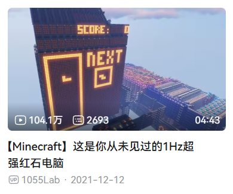
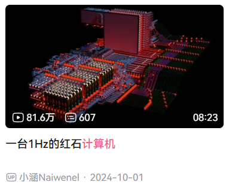
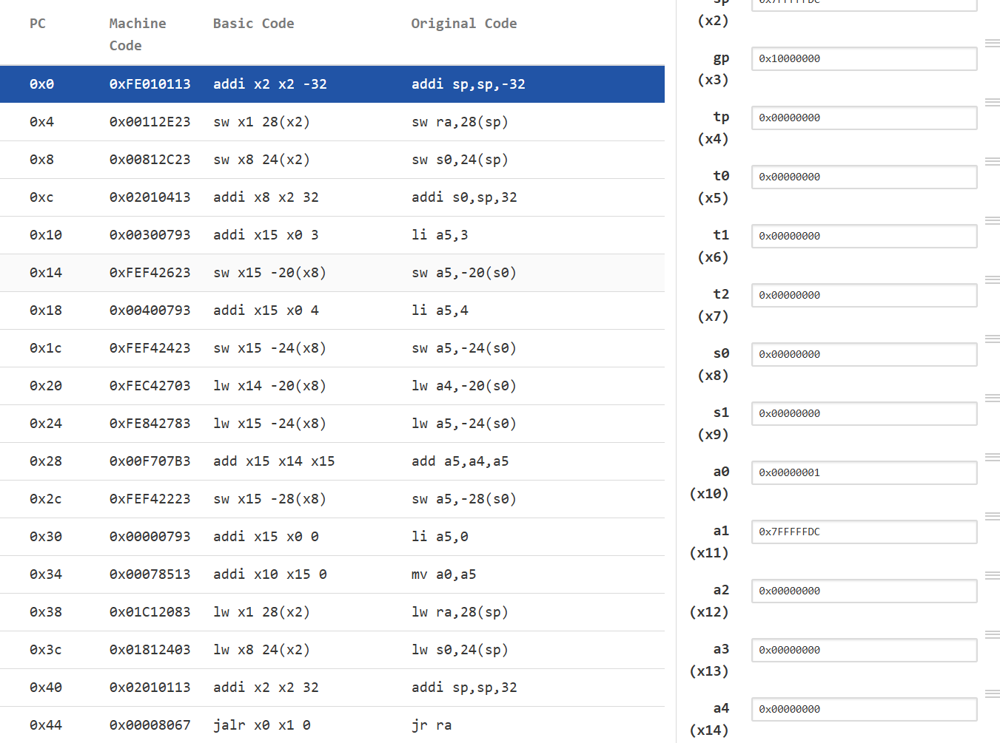
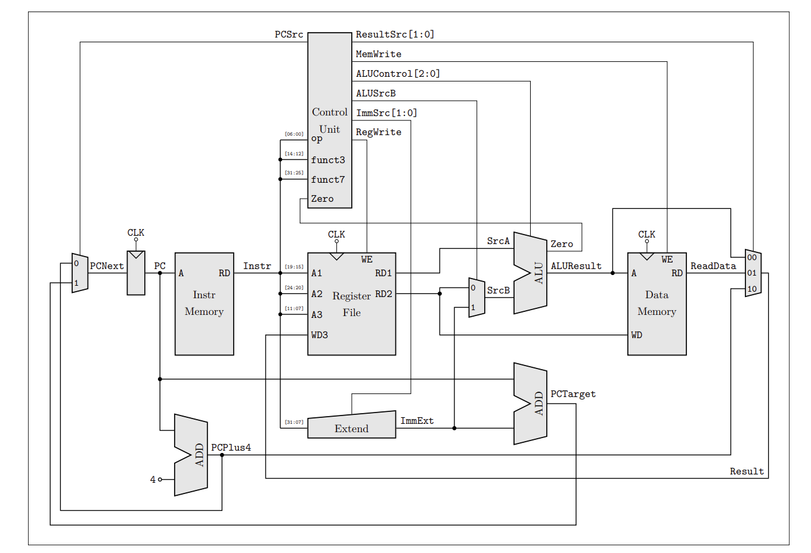
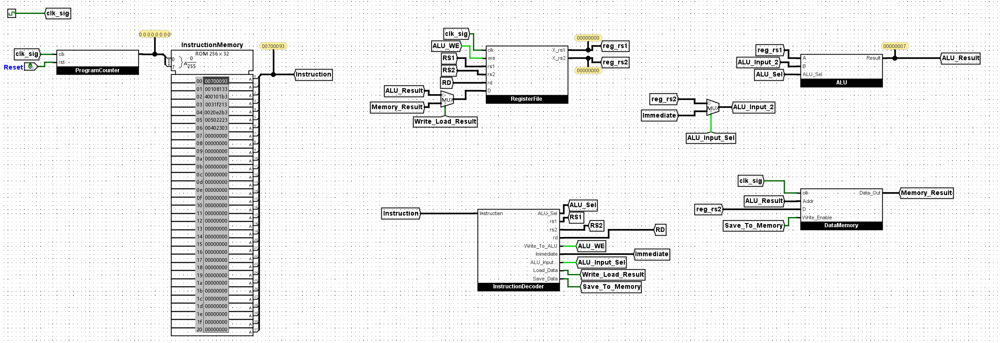

<!-- _class: cover_e -->
<!-- _footer: "" -->
<!-- _paginate: "" -->
# Project Of SI100B EE Part
###### RISCV miniCPU Design in Logisim

Speaker Chaofan Li
<small>lichf2025@shanghaitech.edu.cn</small>

---
## Contents
<!-- _class: toc_a -->
<!-- _header: "Contents" -->
<!-- _footer: "" -->
<!-- _paginate: "" -->

- [Background](#3)
- [Tasks](#7)
- [Grading Policy](#10)

---
## Background——What is CPU?

<!-- _class: cols-2-64 -->

---
## Background——Compile

---

## Background——Assembly

---

### Background
<!-- _class: cols-2-64 -->

#### What is RISC-V?
在计算机体系结构中，**指令集架构**（ISA）定义了处理器的基本指令规范，而**微架构**则负责具体实现这些指令的硬件电路设计。

主流的指令集包括 x86、ARM、MIPS 等。与它们不同的是， RISC-V 作为一个全新的**开源指令集架构**正在迅速发展。与闭源的 x86 和 ARM 不同，RISC-V 采用开放标准，允许任何厂商自由使用和实现。

#### ISA vs. Microarchitecture

- **ISA**: 软件能看到的指令和寄存器约定。
- **Microarchitecture**: 让这些指令真正运行起来的硬件组织。
- 本 Project 的目标是用 Logisim 设计一个能执行 RISC-V 子集的 miniCPU。

---
#### Overview of RISC-V Architecture

---
## Tasks
#### Must Part
1. 实现 miniCPU 的 Datapath，包括 RegFile、ALU、PC、IMem、DMem 等。（20%）(在gradescope上有测试点)
2. 实现 miniCPU 的 Controller，包括指令译码、控制信号生成等，并与 Datapath 部分连接，实现指令执行。（20%）
3. 使用 Python 编写一个简单的汇编器，将 RISC-V 汇编代码转换为机器码。（20%）
4. 手动编写汇编程序，完成指定功能，加载到 miniCPU 的指令存储器中，观察 miniCPU 的运行情况。（15%）
4. 实验报告。（25%）

---
## Tasks
#### Must Part (Result Example)

---

#### Bonus
1. 为单周期 miniCPU 添加流水线。
   > 添加流水线之后，你可能会遇到被称之为“冒险”（Hazard）的问题，你需要设计合适的解决方案来处理这些冒险问题。
2. 为 miniCPU 增加更多指令的支持。

> 我觉得自己特别厉害！那么可以尝试以下 Bonus
3. 为 miniCPU 添加向量运算单元，并支持一些向量指令的支持。
4. 为 miniCPU 支持标量-向量双发射。
5. 使用 Spinal HDL 完成 miniCPU 的设计与实现！（**Recommended**）
   - 如果你决定使用 Spinal HDL 来实现 miniCPU，你可以不实现 Logisim 版本。请务必提前联系助教！完成相同的任务，使用 Spinal HDL 实现的项目将获得额外的加分。

---
## Grading Policy
<!-- _class: trans -->
<!-- _footer: "" -->
<!-- _paginate: "" -->

---
## About AI?
- 在我们的 Project 中，我们**允许任何 AI 工具的使用**。但是，请**务必确保你理解你的 AI 做了什么**。如果在最终的 Check 中你的回答是“AI 这么写的，我也不太清楚”，那么我们可能会认为你并没有真正理解你的实现，从而影响你的评分。
- 请同学们在合作中遵守基本的学术诚信原则。**组间的抄袭**是严格禁止的。
- 允许参考公开的资源实现，但请按照自己的理解进行调整和修改。如果你参考了公开的资源（例如 GitHub 上的开源项目），请务必在报告中注明引用来源。非复制粘贴的参考不会影响你的评分。

- 即使存在 Bug，如果你能准确描述 Bug 的原因，并展示你为解决 Bug 所做的努力，我们也会给予一定的分数。实现固然重要，但我们更看重你在实现过程中所展现的理解和思考！

---
### Grading Policy for Bonus Tasks
#### Bonus
- Bonus 部分的分数将在基础分数的基础上进行加分。
- 这部分不会有 OJ 测试，但我们会在面对面 Check 的时候，检查你们的实现。
  - 你们需要自己设计合适的测试用例，以证明你们的实现是正确的。否则，我们可能会认为你们的实现是不完整的，从而你们的加分也会受到影响。
- 和 Must 一样，即使你们的实现不完整，如果在报告中展现了你们的尝试和思考，并做出有意义的尝试和分析，我们也会给予一定的加分。

---

### Who should choose our project?

- 对“计算机到底是怎么运行程序的”感兴趣的同学
   - 不要求你来自信院，也不要求你已经学过体系结构或数字电路
   - 只要你愿意把一个系统拆开来看，理解从指令、寄存器到简单 CPU 的基本工作过程
- 来自生命、物质、创艺与艺术等专业，但希望补一块计算机底层视角的同学
   - 生命/生技方向：如果你未来会接触计算、生物信息、自动化实验或数据分析，理解计算机如何执行程序会很有帮助
   - 物理/化学/材料方向：如果你关心仿真、仪器控制、高性能计算或硬件相关工具，这个 Project 可以帮你建立硬件和软件之间的连接
   - 创艺方向：如果你对交互装置、创意编程、生成式艺术或软硬件结合感兴趣，这里会提供一个更接近机器本身的入口
- 希望挑战一点“看起来不像本专业”的内容，但不想直接跳进高 workload 专业课的同学
   - 我们会更看重你是否理解自己的实现，而不是你一开始是否有相关背景
   - 即使最后没有做得非常完整，只要能讲清楚尝试、问题和思考，也会有相应的评价空间

---
<!-- _class: lastpage -->
<!-- _footer: "" -->
<!-- _paginate: "" -->

###### Thank You

- SI100B EE Part
- Project Introduction
- Q&A

